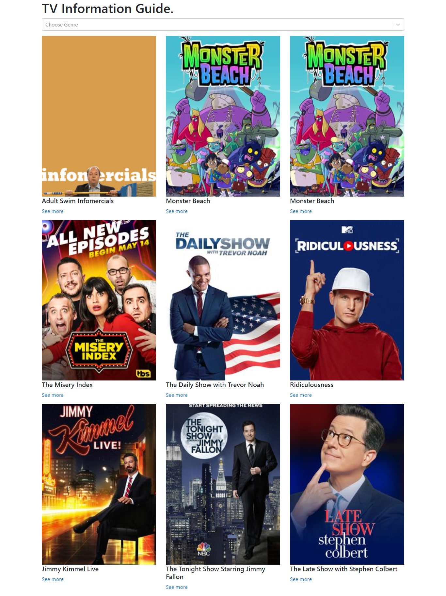
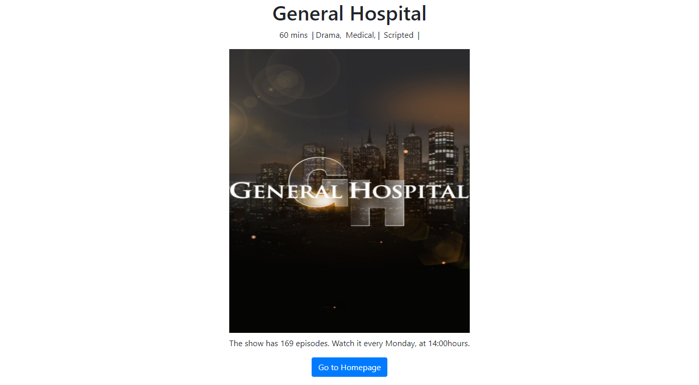

# Tv Information Guide

## Project description
A simple tv guide application built using React and Redux. The tv show data used in the application is collected from an api called [tvmaze](http://api.tvmaze.com/schedule?country=US&date=2020-12-01).

## Screenshot




## Built with
- Javascript
- Javascript design patterns
- Node.js
- React.js
- Redux

## Live Demo link
[tvmaze-guide](https://tvmaze-guide.herokuapp.com/)


## Video Presentation

[video](https://youtu.be/OmsM9D5c7Mc)

## Getting Started

To get a local copy up and running follow these simple example steps.

## Prerequisites

- Install node.

## Set up

- Clone the project.
- Cd into the project directory.
- Run ```yarn install``` to install dependencies in package.json.
- Run ```npm start``` and view the page on your localhost.


## Contributions

 If you see something wrong or not working, please check [the issue tracker section](https://github.com/blackpintz/Tv-shows/issues), if that problem you met is not in already opened issues then open a new issue by clicking on `new issue` button.

## Author

👤 **Rose Wanjohi**
- Github: [@blackpintz](https://github.com/blackpintz)
- Twitter: [@blackpintz](https://twitter.com/blackpintz)
- Linked: [Rose Wanjohi](https://www.linkedin.com/in/rosewanjohi/)

## Acknowledgements

- [tvmaze](https://www.tvmaze.com/)
- [Microverse](https://www.microverse.org/)

## Show your support

Give a ⭐️ if you like this project!
